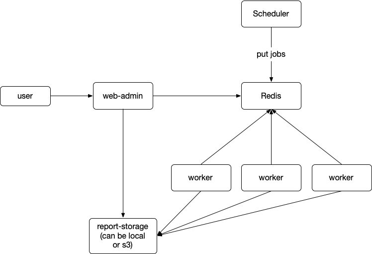

# reporter

Do some checks every day, so that you can read the "news" in the morning while
drinking coffee.

## Install

## How to write a check?

### Define the "target" you want to check

```python
from reporter import Target

class IPTarget(Target):
    def __init__(self, ip):
        self.ip = ip
```

### Define how to check that "target"

```python
from reporter import check

@check(IPTarget)
def check_ip(target):
   return True, "it's ok"
```

A check function can:

- generates more targets: as long as the target can be checked by another
  checker;
- or return True/False to indicate the check was passed or not, plus a string
  indicate the extra information

### How to deploy?

Reporter has 3 components:

- scheduler
- worker
- admin-web

Architecture:


