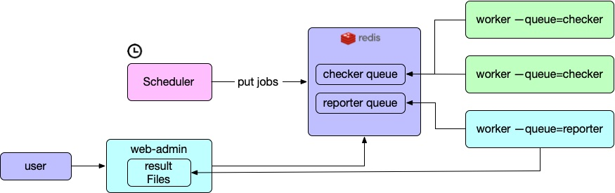

# patrolify

Do some checks every day, so that you can read the "news" in the morning while
drinking coffee.

## Install and Deploy

All of the components are packaged to a Python package, install via:

```shell
pip install patrolify
```

### How to deploy?

Reporter was written in pure Python, and only use Redis and local file system,
requirements:

- Python 3.11+
- Redis 5.0+

Then you need to run 4 components after installation:

|Component Name|What for?|Dependencies|Command example|Can deploy instances?|
|--------------|---------|------------|---------------|---------------------|
|admin|A portal so that you can see the results|filesystem, Redis|`patrolify --redis-url redis://127.0.0.1:6379 admin --port 8084`|Yes, as long as the result directory exist.|
|scheduler|Trigger the checker jobs|Redis|`rqscheduler --host localhost --port 6379 --db 0` (it's redis' `host` and `port`)| Yes, supports auto fail over|
|worker(for checker)|Get jobs from queue(Redis) and run it|Redis|`patrolify --redis-url redis://127.0.0.1:6379 worker --queue=checker`|Yes, every worker will get jobs from queue and run it, more workers, more work load|
|worker(for reporter)|Get jobs from queue(Redis) and run it, only works for collecting the results|Redis|`patrolify --redis-url redis://127.0.0.1:6379 reporter --queue=patrolify`|Yes, same above. But it must be deployed onto the same server with admin|

Architecture:



## How to Write Checker?

Please see [How to Write Checker?](./docs/how-to-write-checker.md).
