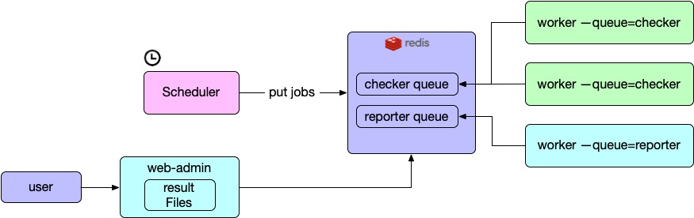

# patrolify

Do some checks every day, so that you can read the "news" in the morning while
drinking coffee.

## Install

## How to write a check?

### Define the "target" you want to check

```python
from patrolify import Target

class IPTarget(Target):
    def __init__(self, ip):
        self.ip = ip
```

### Define how to check that "target"

```python
from patrolify import check

@check(IPTarget)
def check_ip(target):
   return True, "it's ok"
```

A check function can:

- generates more targets: as long as the target can be checked by another
  checker;
- or return True/False to indicate the check was passed or not, plus a string
  indicate the extra information

### Test Your Checker

In local environment, you can test your checker from `__main__`. But you need
to fire `local_test_setup()` first.

For example, you can write this in your `checker.py`:

```python
if __name__ == '__main__':
    from patrolify.utils import local_test_setup
    local_test_setup()

    print(check_ip(IPTarget("127.0.0.1")))
```

### How to deploy?

Reporter was written in pure Python, requirements:

- Python 3.11+
- Redis 5.0+

Installation(The name `patrolify` was taken on Pypi):

```shell
pip install patrolify
```

Then you need to run 4 components after installation:

|Component Name|What for?|Dependencies|Command example|Can deploy instances?|
|--------------|---------|------------|---------------|---------------------|
|admin|A portal so that you can see the results|filesystem, Redis|`patrolify --redis-url redis://127.0.0.1:6379 admin --port 8084`|Yes, as long as the result directory exist.|
|scheduler|Trigger the checker jobs|Redis|`rqscheduler --host localhost --port 6379 --db 0` (it's redis' `host` and `port`)| Yes, supports auto fail over|
|worker(for checker)|Get jobs from queue(Redis) and run it|Redis|`patrolify --redis-url redis://127.0.0.1:6379 worker --queue=checker`|Yes, every worker will get jobs from queue and run it, more workers, more work load|
|worker(for patrolify)|Get jobs from queue(Redis) and run it, only works for collecting the results|Redis|`patrolify --redis-url redis://127.0.0.1:6379 worker --queue=patrolify`|Yes, same above. But it must be deployed onto the same server with admin|

- scheduler
- worker (2 types, for running checker jobs and patrolify jobs)
- admin

Architecture:


