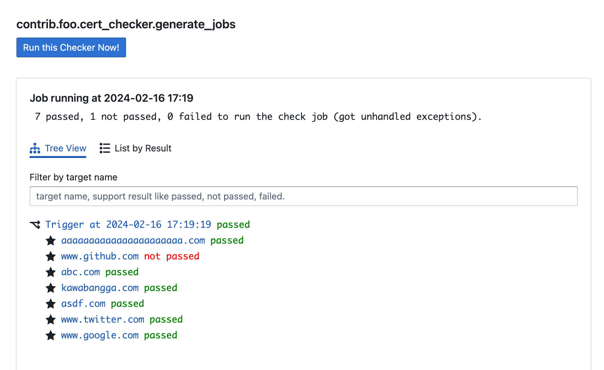
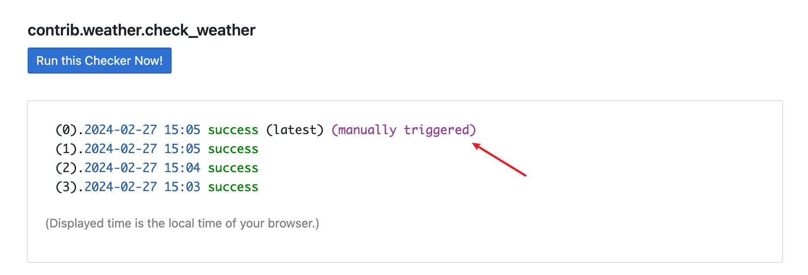

### how to Write Checker?

### Your First Checker

A checker is simply a Python function. The function parameter is a `Target`
object, the return value is a tuple: `(bool, str)`, first value is a `bool`
to indicate the checking result is success or not, the second value is a `str`,
can be whatever you want to display.

So a simple checker can be like this:

```python
from patrolify.decorators import trigger


@trigger(cron_string="0 10 * * *", description="Check todays weather")
def check_weather(time_target):
    if today_is_sunnyday():
        return True, "I'm very happy"
    else:
        return False, "I'm not happy"
```

This script use `@trigger` to register itself to run every 10:00 am in the
morning.

After reloading the scheduler and worker, you can see this checker from admin's
home page:


### More targets!

What if I have more than one target to check? For example, I want to check 100
cities weather?

You can still write the checker in one function, use a for-loop. But it has
drawbacks:

- If it failed during check one target, the whole function would fail;
- You have to check them one by one

And... Why bother to have a system doing this? Why not just using a Python
script?

Patrolify gives you a "queue", this means that you can put your targets into
the queue, and workers will fetch targets from the queue, and check them.

To do this, you need to write:

- a target class
- a function that generates target (put them into queue)
- a function that checks one target

This time, let's check HTTPS certs expiry.

Define the target.

```python
from patrolify.target import Target


class SiteTarget(Target):
    def __init__(self, domain):
        super().__init__()
        self.domain = domain

    def __str__(self) -> str:
        return self.domain
```

You can define any attributes you want, here we define `.domain` because we
need this when do the checking.

`__str__` method will be used to display in the admin page, so better to have
a good looking one.

Define the target generator.

```python
@trigger(interval_seconds=1 * 60)
def generate_jobs(time_target):
    for domain in [
        "www.google.com",
        "www.twitter.com",
        "www.github.com",
        "abc.com",
        "asdf.com",
        "kawabangga.com",
        "aaaaaaaaaaaaaaaaaaaaaa.com",
    ]:
        yield SiteTarget(domain=domain)

    return True, "The job has been started"
```

This function is very like one previous one, just we do not only return a tuple
in the end, we need to `yield` `SiteTarget`.

Define the checker.

```python
from patrolify.decorators import check

@check(SiteTarget)
def check_site(target):
    domain = target.domain
    cert = ssl.get_server_certificate((domain, 443))
    x509 = OpenSSL.crypto.load_certificate(OpenSSL.crypto.FILETYPE_PEM, cert)
    time = x509.get_notAfter()
    date_string = time.decode()
    format_string = "%Y%m%d%H%M%SZ"
    parsed_datetime = datetime.strptime(date_string, format_string)

    days = (parsed_datetime - datetime.now()).days

    if days > 30:
        return True, f"{target.domain} will be expired in {days}days."
    else:
        return False, f"{target.domain} will be expired in {days}days."
```

This function is still very like the previous one. But instead of using
`@trigger`, we use `@check` to indicate which kind of target this function
can check.

All done 🎉.

In admin page, you will see the targets in tree view based on the relation.



(Oops, github.com's cert is about to expire, hope they fix that!)

### Test Your Target

Triggers, Checkers, are all just functions, so you can test them as you testing
a normal function in Python.

In local environment, you can test your checker from `__main__`. But you need
to fire `local_test_setup()` first.

For example, you can write this in your `checker.py`:

```python
if __name__ == '__main__':
    from patrolify.utils import local_test_setup
    local_test_setup()

    print(check_ip(IPTarget("127.0.0.1")))
```

You can also manually trigger a exeuction from the admin page.


